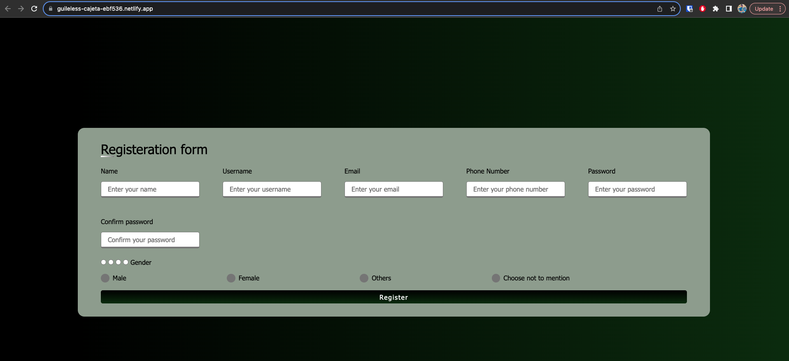

# Form Project: Responsive Registration Form

Welcome to the **FormProject**, where we've created a basic registration form using HTML and CSS! This project showcases the fundamental concepts of web development by building a user-friendly and responsive registration form. The form allows users to input their personal information and select their gender before submitting the registration.

You can check it out on this link: [Form](https://guileless-cajeta-ebf536.netlify.app/) 

## Project Overview

The FormProject features a straightforward registration form that collects the user's details and gender preference. Here's an overview of the main components:

- **User Details:** The user details section includes input fields for the user's name, username, email, phone number, password, and confirmation of the password.

- **Gender Selection:** The gender section offers four options for gender selection: Male, Female, Others, and Choose not to mention. Users can select their gender preference using radio buttons.

- **Submit Button:** At the bottom of the form, a "Register" button allows users to submit their information.

## How to Use

To use the FormProject's registration form, follow these simple steps:

1. Open the `index.html` file in your web browser.

2. The registration form will be displayed, including input fields for various user details.

3. Fill in the required information, including your name, username, email, phone number, password, and password confirmation.

4. Select your gender preference by clicking on one of the radio buttons provided.

5. Once you have entered all the necessary information and selected your gender, click the "Register" button to submit the form.

6. Feel free to explore the responsiveness of the form by resizing your browser window. The form should adapt to different screen sizes.

## Technologies Used

The FormProject is built using the following technologies:

- HTML: For creating the structure of the registration form.
- CSS: For styling the visual elements of the form, including layout, colors, and typography.

## Acknowledgments

This project serves as a starting point for creating various types of forms, from registration forms to surveys and feedback forms. It demonstrates how HTML and CSS can be used to create user-friendly and visually appealing web forms.

## Credits

Special thanks to Codecademy for providing valuable resources and tutorials for web development, contributing to the creation of the FormProject.

---

Experience the simplicity and functionality of the FormProject's registration form. Streamline the user registration process and gather essential information with ease. For any inquiries or feedback, feel free to contact us.

Get started with the FormProject's registration form now! 📝👥
